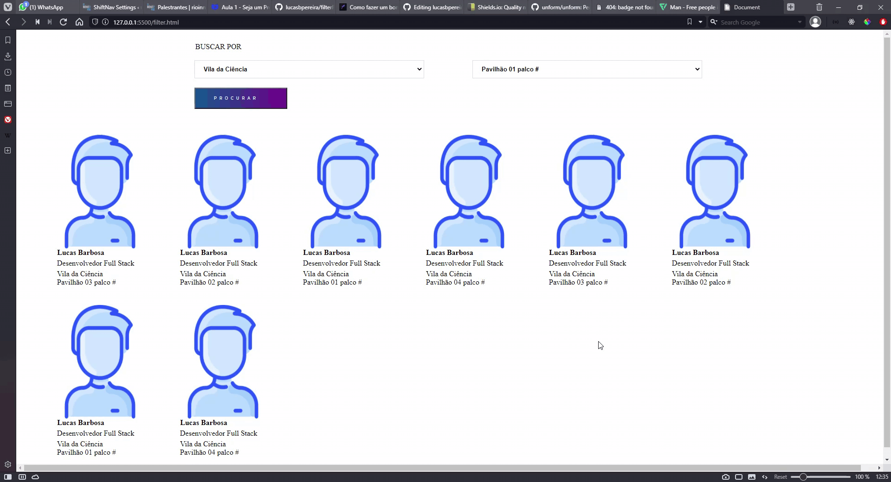

# JavaScript Filter

## Created for a Rio Innovation Week website.

<h1 align="center">
    <a href="https://www.javascript.com">JavaScript</a>
</h1>

 <a href="#objetivo">Objetivo</a> •
 <a href="#roadmap">Roadmap</a> • 
 <a href="#tecnologias">Tecnologias</a> • 
 <a href="#contribuicao">Contribuição</a> • 
 <a href="#licenc-a">Licença</a> • 
 <a href="#autor">Autor</a>

<h4 align="center"> 
	Status 🚀 Finished... 
</h4>

### 🔍Features

- [x] Filter an Array List

### Prerequisites
- [VSCode](https://code.visualstudio.com/) (or your favorite code editor)
- Plugin that allows adding html code (if you are a Wordpress user)

## 🦸 Autor

<a href="https://github.com/lucasbpereira">
 
  
 <b>Lucas Barbosa</b></a> <a href="https://github.com/lucasbpereira" title="Lucas Barbosa">🚀</a>
  

---

## 📝 Licença

Este projeto esta sobe a licença [MIT](./LICENSE).

Desenvolvido por Lucas Barbosa 👋🏽 [Entre em contato!](https://www.linkedin.com/in/lucasbpereira/)